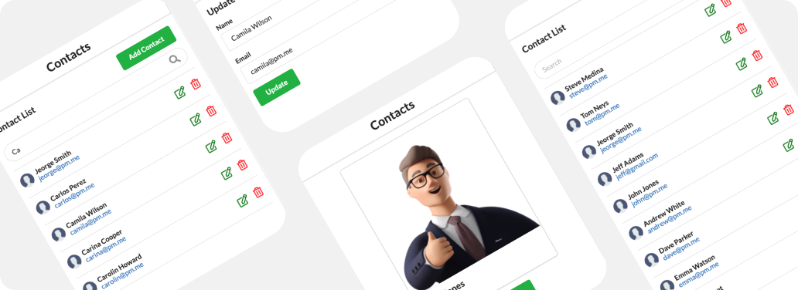

# Contacts List

This is a simple contacts lists built with React and Semantic UI. It performs all CRUD operations on a JSON server which is basically a fake REST api. 

### How to run :) 
- Clone [contacts-json-server](https://github.com/Berto-m/contacts-json-server) repo
- cd into into it 
- npm install
- npm start and open it on http://localhost:3001
- Clone this repo
- cd into into it
- npm install
- npm start

